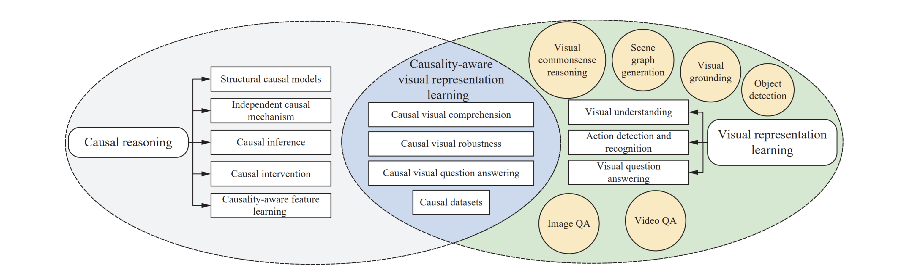

## [Causal Reasoning Meets Visual Representation Learning: A Prospective Study](https://link.springer.com/article/10.1007/s11633-022-1362-z)
Machine Intelligence Research (MIR) 2022

<a href="https://orcid.org/0000-0002-9423-9252" target="orcid.widget" rel="noopener noreferrer" style="vertical-align:top;">orcid.org/0000-0002-9423-9252</a>

Homepage: [https://yangliu9208.github.io/home/](https://yangliu9208.github.io/home/)

## Abstract
Visual representation learning is ubiquitous in various real-world applications, including visual comprehension, video understanding, multi-modal analysis, human-computer interaction, and urban computing. Due to the emergence of huge amounts of multimodal heterogeneous spatial/temporal/spatial-temporal data in the big data era, the lack of interpretability, robustness, and out-of-distribution generalization are becoming the challenges of the existing visual models. The majority of the existing methods tend to fit the original data/variable distributions and ignore the essential causal relations behind the multi-modal knowledge, which lacks unified guidance and analysis about why modern visual representation learning methods easily collapse into data bias and have limited generalization and cognitive abilities. Inspired by the strong inference ability of human-level agents, recent years have therefore witnessed great effort in developing causal reasoning paradigms to realize robust representation and model learning with good cognitive ability. In this paper, we conduct a comprehensive review of existing causal reasoning methods for visual representation learning, covering fundamental theories, models, and datasets. The limitations of current methods and datasets are also discussed. Moreover, we propose some prospective challenges, opportunities, and future research directions for benchmarking causal reasoning algorithms in visual representation learning. This paper aims to provide a comprehensive overview of this emerging field, attract attention, encourage discussions, bring to the forefront the urgency of developing novel causal reasoning methods, publicly available benchmarks, and consensus-building standards for reliable visual representation learning and related real-world applications more efficiently.

## Overview

Figure 1:  Overview of the structure of this paper, including the discussion of related methods, datasets, challenges, and the relations among causal reasoning, visual representation learning, and their integration. 

## Media Report
[WeChat Official Account](https://mp.weixin.qq.com/s/-OlJ44DWE6nuX_OVyykURw)  
[Tencent News] (https://view.inews.qq.com/a/20221214A04HLV00)    
[BAAI Newsletter] (https://hub.baai.ac.cn/view/22520)  
[Sina Weibo] (https://m.weibo.cn/3127546767/4846600603830090)  
[MIR Official Website] (https://www.mi-research.net/)  
[Twitter] (https://twitter.com/MIR_Journal/status/1602935511903260674)  
[Facebook] (https://www.facebook.com/profile.php?id=100071154460921)  
[ScienceNet](https://blog.sciencenet.cn/home.php?mod=space&uid=749317&do=blog&id=1367867)  

```
   @article{liu2022causal,
            title={Causal Reasoning Meets Visual Representation Learning: A Prospective Study},
            author={Liu, Yang and Wei, Yu-Shen and Yan, Hong and Li, Guan-Bin and Lin, Liang},
            journal={Machine Intelligence Research},
            pages={1--27},
            year={2022},
            publisher={Springer}
            }
``` 
If you have any question about this paper, feel free to reach me (liuy856@mail.sysu.edu.cn) 
